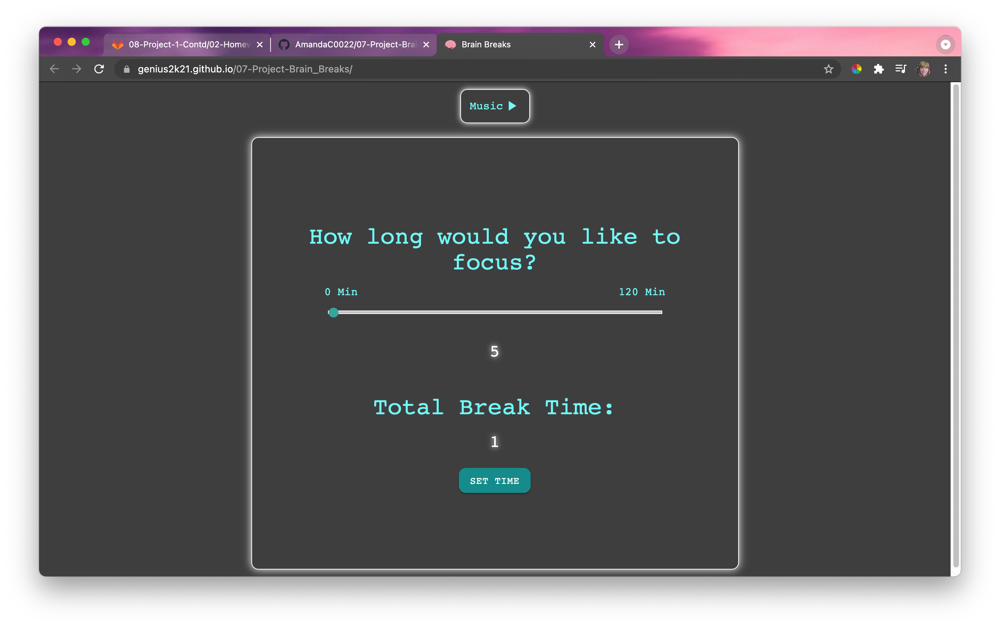
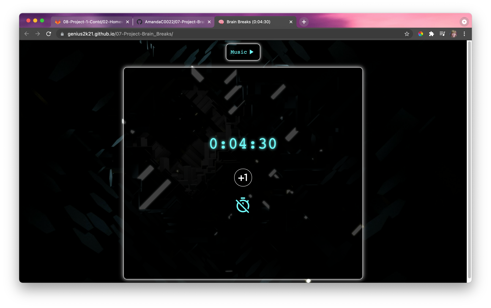

# 07-Project-Brain_Breaks

## Description 
Brain Breaks, a productivity app that helps students and business professionals plow through difficult work by using positive reinforcement to keep the vibes up!

This was a group project between Hudson Hancock, Sebastain Campos, and myself. 

## List of Technologies Used: 
- HTML
- Google Slides 
- CSS
- Materialize 
- JavaScript 
- Swiper JS
- Youtube API
- Reddit API
- NPM package 
- JQuery 

## WireFrame Link  
https://docs.google.com/presentation/d/1qBSgIElZMBmw84jxmF-EC92PJoE1JwTOrJpiG5sebOE/edit#slide=id.ge72745039d_0_0

## Deployed App 
https://genius2k21.github.io/07-Project-Brain_Breaks/

## Github Repo Link 
https://github.com/AmandaC0022/07-Project-Brain_Breaks

## Screenshots 

## Collaborators 
- Hudson Hancock Github Profile: https://github.com/hudsonhancock 
- Sebastan Campos Github Profile: https://github.com/scampos321 

## Lincense 
Copyright 2021

Permission is hereby granted, free of charge, to any person obtaining a copy of this software and associated documentation files (the "Software"), to deal in the Software without restriction, including without limitation the rights to use, copy, modify, merge, publish, distribute, sublicense, and/or sell copies of the Software, and to permit persons to whom the Software is furnished to do so, subject to the following conditions:

The above copyright notice and this permission notice shall be included in all copies or substantial portions of the Software.

THE SOFTWARE IS PROVIDED "AS IS", WITHOUT WARRANTY OF ANY KIND, EXPRESS OR IMPLIED, INCLUDING BUT NOT LIMITED TO THE WARRANTIES OF MERCHANTABILITY, FITNESS FOR A PARTICULAR PURPOSE AND NONINFRINGEMENT. IN NO EVENT SHALL THE AUTHORS OR COPYRIGHT HOLDERS BE LIABLE FOR ANY CLAIM, DAMAGES OR OTHER LIABILITY, WHETHER IN AN ACTION OF CONTRACT, TORT OR OTHERWISE, ARISING FROM, OUT OF OR IN CONNECTION WITH THE SOFTWARE OR THE USE OR OTHER DEALINGS IN THE SOFTWARE.
